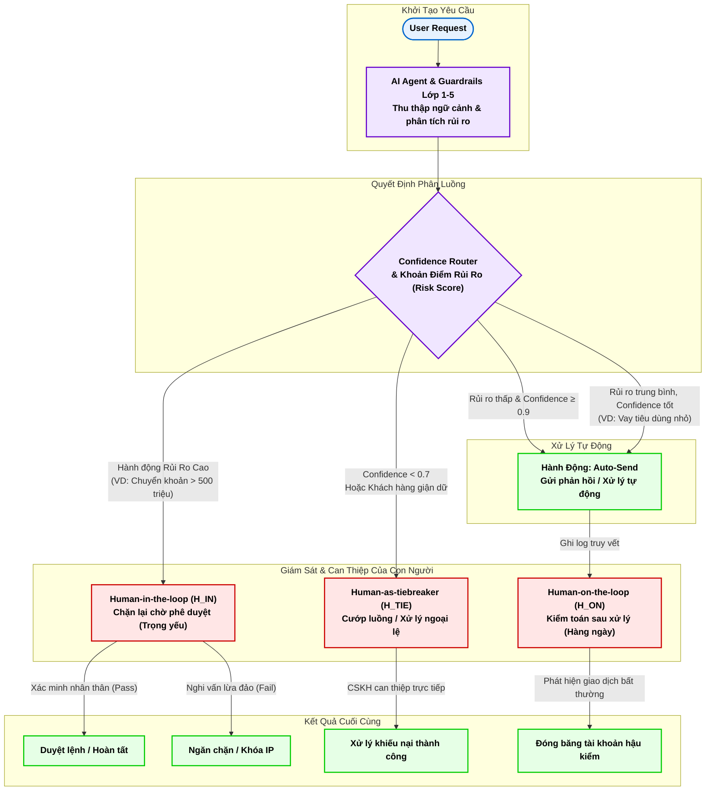

# Báo Cáo: Sơ Đồ Thiết Kế Quyết Định HITL (Human-in-the-Loop)
*(Hỗ trợ Deliverable 2 của khóa học)*

Sơ đồ trình bày kiến trúc phân luồng (Routing Architecture) mà chúng ta thiết lập tại file `hitl.py`. Kiến trúc này kết hợp **AI Guardrails** và **Con người (Human Experts)** để đưa ra chốt phán quyết chính xác cho lĩnh vực tài chính rủi ro cao.

## Bảng Ma Trận Phân Luồng (Routing Matrix)

Nếu bạn cần biểu diễn dưới **dạng bảng** để đưa vào Doc hệ thống (Matrix), đây là bảng đối chiếu chính xác với quy trình ở Flowchart trên:

| Loại Giao Dịch & Ngữ Cảnh | Mức Độ Rủi Ro | Độ Tự Tin (Confidence) | Luồng Xử Lý | Hành Động Hệ Thống | Vai Trò Của Con Người |
|:---|:---:|:---:|:---|:---|:---|
| **Thông thường** (Tra cứu số dư, Lịch sử) | Thấp | Tốt (`≥ 0.9`) | **Auto-Send** | Xử lý & Phản hồi ngay lập tức | *(Không cần can thiệp)* |
| **Có kiểm soát** (VD: Vay tiêu dùng nhỏ) | Trung bình| Tốt (`≥ 0.8`) | **Human-on-the-loop** | Chạy Task tự động & Ghi Log truy vết | Rà soát Log, tạm ngưng nếu phát hiện gian lận hậu kiểm |
| **Trọng yếu / Nhạy cảm** (Chuyển khoản lớn) | Cao | Bất kỳ | **Human-in-the-loop** | Chặn Request, đẩy vào Hàng đợi (Queue) | Xác minh nhân thân / Thẩm định hồ sơ trước khi cấp lệnh |
| **Tình huống mơ hồ** (Thiếu dữ kiện mấu chốt) | Bất kỳ | Thấp (`< 0.7`) | **Human-as-tiebreaker**| Tạm dừng quyết định, báo hiệu "Bế tắc" | Chuyên viên tiếp quản, đặt câu hỏi thu thập thêm dữ liệu|
| **Cảm xúc tiêu cực** (Khách hàng giận dữ) | Bất kỳ | Bất kỳ | **Human-as-tiebreaker**| Tắt luồng tự động, chuyển line nóng | Cấp quản lý/CSKH bậc 2 xen ngang xoa dịu và đàm phán |

## Chi tiết các Thuộc Tính:

1. **Human-in-the-loop (H_IN):** Mô hình cổ điển và an toàn nhất của ngành Ngân Hàng. AI tự động tước quyền chạy Request API. Khách hàng bắt buộc phải đợi sự quyết định trực tiếp của người xét duyệt. AI lúc này chỉ đóng vai trò soạn trước tài liệu Summary cho Người duyệt đọc (tiết kiệm 80% thời gian xử lý thủ công).
2. **Human-on-the-loop (H_ON):** Mô hình hiện đại của Automation. AI tự tin và được uỷ quyền chạy ngay Task (Tăng 100% độ thỏa mãn khách hàng). Ban thẩm định vẫn giám sát bảng log giao dịch định kỳ, nếu có biến (VD: Scammer hàng loạt) lập tức rút dây dừng cỗ máy lại.
3. **Human-as-tiebreaker (H_TIE):** Chỉ kích hoạt cho ngoại lệ (Exceptions). Khi máy móc dự đoán trường hợp nằm ngoài ranh giới xử lý (Tư vấn viên AI chịu bế tắc hoặc NLP đọc hiểu báo động đỏ do khách giận dữ), người thợ cứng chuyên giải quyết khiếu nại (CSKH Cấp 2) sẽ lấy lại phiên (Takeover). Lúc này AI nhường ghế tài xế cho Con người.
